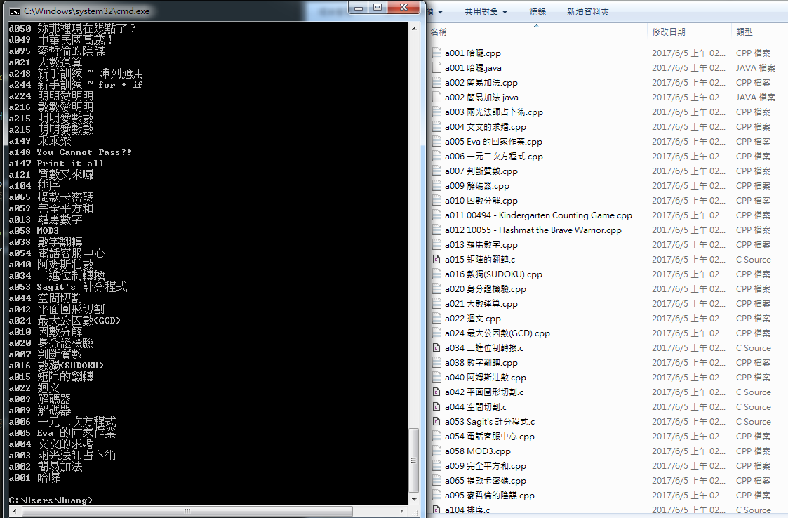

# Zerojudge-AC-Code-Crawler
爬zerojudge的AC code
## Screenshot

## 遇到的問題
* 照之前的方法直接使用`html.parser`解析遇到`textarea`會有下面的問題，後來改用`html5lib`解析就解決了
```
<textarea>
#include<stdio.h> // BeatifulSoup會把<stdio.h>視為標籤，導致讀取出來的東西錯誤
int main(){
  return 0;
}
</textarea>
```
* windows檔名問題，懶人解決方法
```
# 刪除windows保留字
questionName = questionName.replace("\\","").replace(".","").replace("?","").replace("*","").replace("/","").replace("|","").replace(":","").replace(">","").replace("<","").replace("\"","")
```
